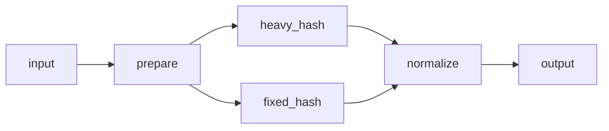

# Piper

Piper is a Rust library for building staged data pipelines.

- `Pipe` is the fixed-width worker primitive for accumulator-style workloads.
- `Piper` is the managed pipeline harness with live outputs, graph-based fork/join execution, dynamic anchor-based worker scaling, pull-based telemetry, optional CSV telemetry, graceful shutdown, abort, and reusable internal buffer leases.
- `pipeline!` is re-exported from the runtime crate and generates a typed pipeline wrapper from either linear stage sugar or named graph edges.

Forks are MPMC work-sharing fan-out: each item emitted onto a forked link is consumed by one downstream branch, not broadcast to every branch. Joins are merged streams where multiple upstream stages send the same type into one downstream link.

Dynamic pipelines can mark one or more heavy stages with `anchor(...)`; Piper scales scalable anchors carefully up to their configured maximum and scales surrounding stages to keep anchors fed and drained. `anchor(...).fixed_threads(n)` marks a fixed control point that the manager tunes around but never resizes.

## Fork/join graph pipeline

Graph pipelines declare every stage by name in `stages = { ... }`, then wire them with `graph = { ... }` edges. The full runnable version lives in [examples/fork_join_pipeline.rs](examples/fork_join_pipeline.rs).



```rust
use piper::{PiperConfig, anchor, pipeline, stage, StageExt};

pipeline! {
    pub struct ForkJoinPipeline {
        type Input = Batch;
        type Output = BatchLease;
        type Error = ExampleError;

        config = config();
        stages = {
            prepare = Prepare.with_reusable_output(|| Vec::<u64>::with_capacity(BATCH_SIZE)),
            heavy_hash = anchor(HeavyHash)
                .max_threads(max_parallelism())
                .with_reusable_output(|| Vec::<u64>::with_capacity(BATCH_SIZE)),
            fixed_hash = anchor(FixedHash)
                .fixed_threads(2)
                .with_reusable_output(|| Vec::<u64>::with_capacity(BATCH_SIZE)),
            normalize = stage("normalize", Normalize),
        };
        graph = {
            input -> prepare;
            prepare -> [heavy_hash, fixed_hash];
            [heavy_hash, fixed_hash] -> normalize;
            normalize -> output;
        };
    }
}

let piper = ForkJoinPipeline::start()?;
```

### Graph syntax

| Rule | Meaning |
|------|---------|
| `stages = { name = expr, ... }` | Each graph node is a named stage expression (`Stage`, `stage(...)`, `anchor(...)`, etc.). |
| `graph = { a -> b; ... }` | Semicolon-separated directed edges. |
| `input` / `output` | Reserved pipeline endpoints (not stage names). |
| `source -> [a, b, c]` | **Fork**: work-sharing fan-out (each item goes to one branch). |
| `[a, b, c] -> dest` | **Join**: merged input link for `dest`. |
| Every stage | Must appear on both an incoming and outgoing edge. |

Fork edges are MPMC work-sharing fan-out: each item is consumed by one downstream branch, not broadcast to every branch. Join edges merge multiple upstream stages into one downstream link.

To add more parallel branches, add a key in `stages`, list it in the fork bracket, and list it in the matching join bracket (for example `prepare -> [a, b, c]` and `[a, b, c] -> merge`).

```bash
cargo run --release --example fork_join_pipeline
```

See [examples/fork_join_pipeline.rs](examples/fork_join_pipeline.rs) for `Stage` implementations, buffer leases, telemetry, and concurrent output draining. For linear `stages = [ ... ]` sugar without a graph, see [examples/pipeline_api_styles.rs](examples/pipeline_api_styles.rs).
